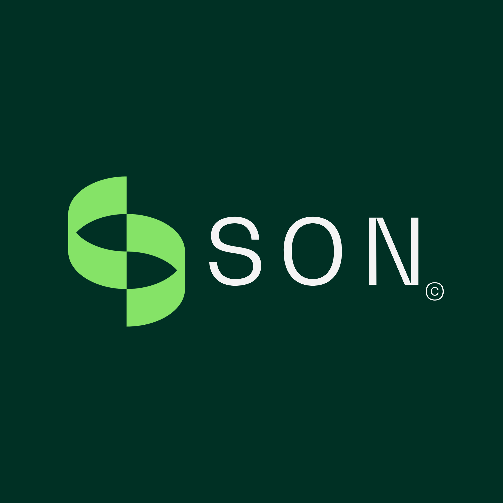

  
  <h1>SON - Sistema de Gestión Operativa</h1>
  
<em>Plataforma integral para empresas de Seguridad, Higiene y Medio Ambiente.</em>

---

## 📖 Sobre el Proyecto

**SON** (anteriormente conocido como Sima Operation) es una plataforma Full-Stack diseñada para digitalizar, controlar y automatizar la gestión de servicios de campo en el rubro de Seguridad, Higiene y Medio Ambiente. 

El sistema conecta una aplicación móvil para los técnicos en la calle con un panel de administración web centralizado, respaldados por una API robusta y una base de datos relacional.

---

## 🛠️ Stack Tecnológico

El proyecto está dividido en tres pilares fundamentales construidos con las siguientes tecnologías:

*   **Aplicación Móvil (Técnicos):** Desarrollada con **Flutter** para despliegue multiplataforma.
*   **Panel Administrativo (Web):** Desarrollado con **Flutter Web** para maximizar la reutilización de código y diseño.
*   **Backend (API & Base de Datos):** Construido en **Node.js** con Express y conectado a una base de datos **PostgreSQL**.

---

## ✨ Funcionalidades Principales

### 📱 App Móvil (Para Técnicos/Operarios)
*   **Autenticación:** Inicio de sesión seguro para operarios registrados.
*   **Dashboard Personal:** Resumen de jornada con métricas de órdenes asignadas, en progreso, completadas y pendientes.
*   **Check-in con GPS:** Captura obligatoria de coordenadas geográficas (latitud y longitud) al llegar al sitio de trabajo.
*   **Gestión de Trabajo en Progreso:**
    *   Visualización de la ubicación en un mapa interactivo (Flutter Map).
    *   Cronómetro de tiempo transcurrido.
    *   Checklist interactivo de microtareas específicas (ej. "Revisar tablero eléctrico").
    *   Captura de evidencias fotográficas utilizando la cámara del dispositivo.
    *   Campo de texto para observaciones y comentarios del técnico.
*   **Cierre y Conformidad:** Lienzo táctil para la firma digital obligatoria tanto del técnico como del cliente en el sitio.

### 💻 Panel Web (Para Administradores)
*   **Panel de Control (Dashboard):** Visión general de las operaciones.
*   **Mapa en Tiempo Real:** Visualización de la ubicación actual de los técnicos.
*   **Gestión de Órdenes (Motor de Recurrencia):** Creación de tareas con asignación de operarios, clientes, descripción, checklist y configuración de repetición automática.
*   **Gestión de Técnicos:** Alta de empleados y administración de credenciales (correos y contraseñas).
*   **Carpetas de Informes:** Organización estructurada de los reportes generados, divididos en carpetas según la empresa cliente.
*   **Panel de Análisis:** Gráficos y promedios operativos (en desarrollo).

### ⚙️ Backend (Node.js) & Almacenamiento
*   **Generador de PDF:** Creación automatizada de reportes formales utilizando la librería `pdfkit`, incluyendo el logo, los datos, el checklist, las fotos y las firmas capturadas.
*   **Almacenamiento Local (Disco K):** El servidor guarda automáticamente los PDFs generados en el servidor de archivos en red de la empresa (`sa-server` / Disco K) organizándolos por carpetas.

---

## 🎨 Diseño y UI/UX

La interfaz de toda la plataforma está estrictamente alineada con la identidad corporativa de SON:
*   **Tipografía Oficial:** `BwGradualDEMO` implementada globalmente en la app y web.
*   **Paleta de Colores:** Integración de los colores institucionales (Verde Oscuro, Verde Claro y Gris Claro) en todos los componentes visuales para mantener la coherencia visual de la marca.